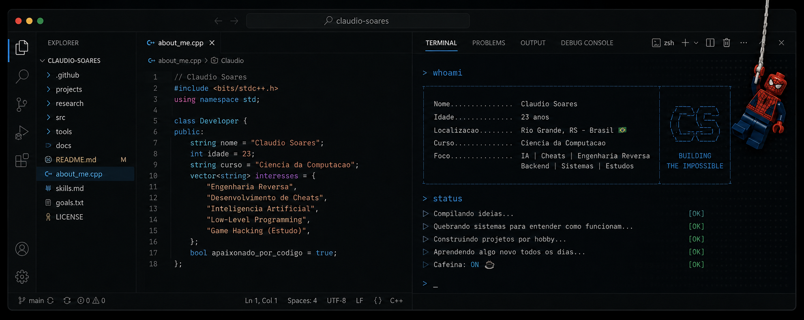

<p align="center">
  
</p>

<br>

<h2 align="center">Claudio Soares</h2>

<p align="center">
Desenvolvo projetos envolvendo cheats, inteligência artificial, engenharia reversa e tudo aquilo que desperta minha curiosidade.
</p>

<p align="center">
<sub>
Ciência da Computação • Full Stack • Engenharia Reversa • Inteligência Artificial
</sub>
</p>

---

## Sobre

Sou estudante de **Ciência da Computação** e gosto de aprender colocando a mão na massa.

A maior parte dos meus projetos envolve desenvolvimento de cheats, engenharia reversa, inteligência artificial, aplicações desktop e desenvolvimento full stack. Estou sempre estudando novas tecnologias e buscando entender como os sistemas realmente funcionam.

---

## Áreas de Interesse

- Desenvolvimento de Cheats
- Inteligência Artificial
- Engenharia Reversa
- Frontend
- Backend
- Desenvolvimento Desktop
- Levantamento de Requisitos
- Arquitetura de Software
- Arduino

---

## Stack

### Linguagens

<p align="center">
  
</p>

### Frameworks & Tecnologias

<p align="center">
  
</p>

### Ferramentas

- Visual Studio Code
- Claude Code
- Antigravity
- Visual Studio 2022
- Postman
- ImGui
- CMake
- Git
- GitHub
- Docker

---

## No Momento

```rust
struct Eu {
    nome: &'static str,

    curso: &'static str,

    cheat: bool,
    aimbot: bool,
    arduino: bool,
    cafe: bool,

    estudando: Vec<&'static str>,

    linguagens: Vec<&'static str>,
}

fn main() {

    let eu = Eu {

        nome: "Claudio Soares",

        curso: "Ciência da Computação",

        cheat: true,
        aimbot: true,
        arduino: true,
        cafe: false,

        estudando: vec![
            "Inteligência Artificial",
            "Engenharia Reversa",
            "Rust",
            "Windows Internals",
            "Arquitetura de Software",
        ],

        linguagens: vec![
            "C++",
            "Go",
            "Rust",
            "TypeScript",
            "JavaScript",
        ],
    };
}
```

---

## Contato

| Plataforma | Contato |
|------------|---------|
| LinkedIn | https://linkedin.com/in/claudiomadruga |
| Discord | **@noguinho** |
